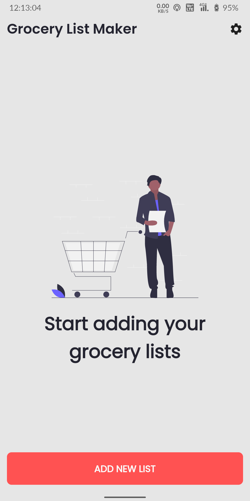
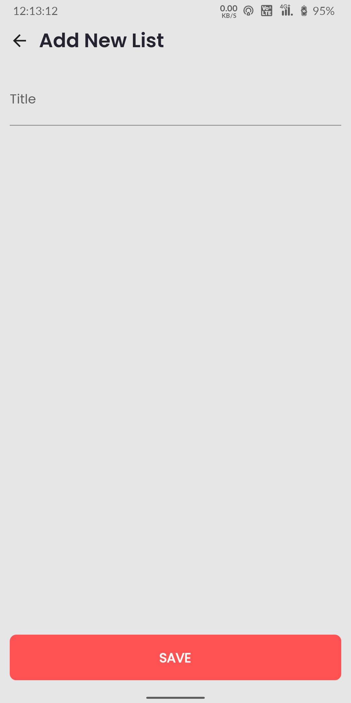
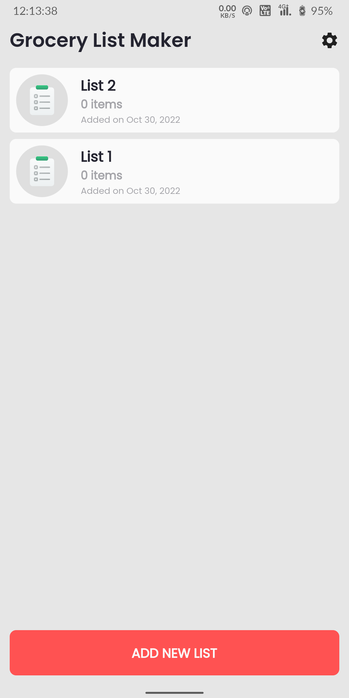
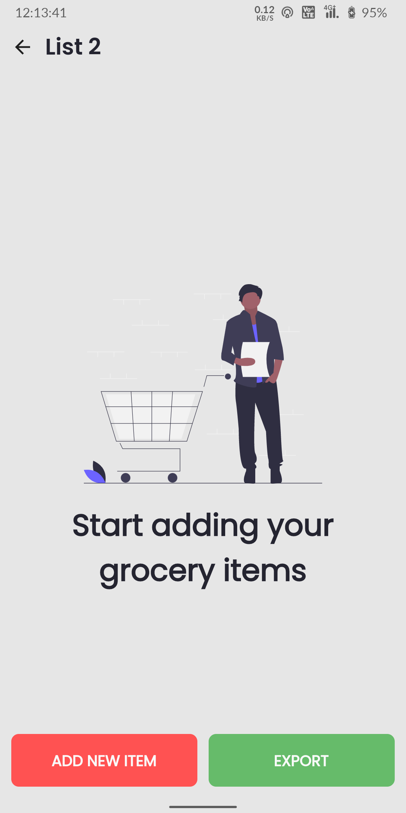
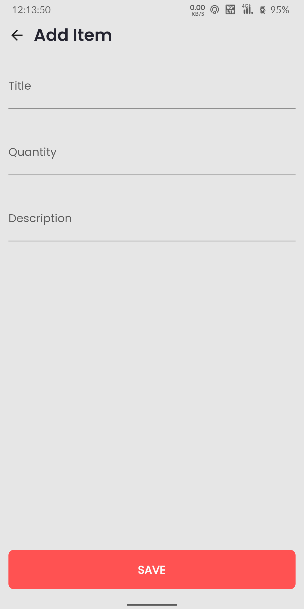
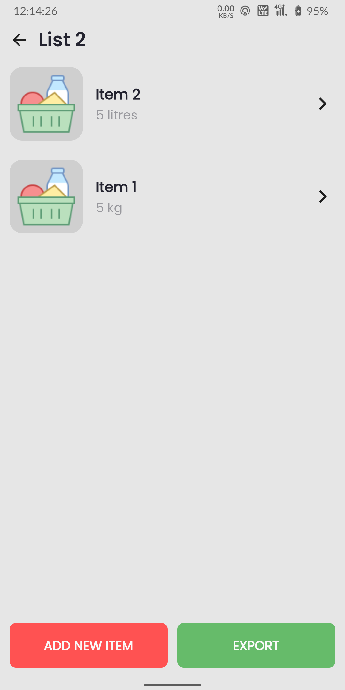
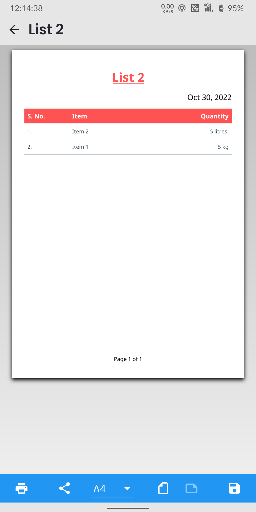

# Grocery List Maker

A mobile app that allows you to create a grocery list and share it with others.

[][releases]

- The app is developed using Flutter and Dart. State management is done using the BLoC pattern and Hive for local storage.

- Right now, the app is only available for Android devices.

- We are open to contributions. If you would like to contribute, please read the
[contribution guidelines](CONTRIBUTING.md).

- We are also open to design suggestions. If you would like to suggest a design, feel free to open an [issue](https://github.com/nixrajput/grocery-list-maker-flutter/issues).

- We are also open to feature requests. If you would like to request a feature, please feel free to open an [issue](https://github.com/nixrajput/grocery-list-maker-flutter/issues). We will try to implement the feature as soon as possible.

- We are also open to bug reports. If you would like to report a bug, please feel free to open an [issue](https://github.com/nixrajput/grocery-list-maker-flutter/issues). We will try to fix the bug as soon as possible.

## Download

You can download the app from the [releases page][releases].

## Contributing

Please read [CONTRIBUTING.md](CONTRIBUTING.md) for details on our code of
conduct, and the process for submitting pull requests to us.

## Authors

- **[Nikhil Rajput][portfolio]** - *Owner & Lead Developer*

## Features

- [x] Add Lists
- [x] Add Item to the List
- [x] Edit List
- [x] Delete List
- [x] Edit Item
- [x] Delete Item

## Screenshots

## License

This project is licensed under the GPL-3.0 License - see the
[LICENSE.md](LICENSE.md) file for details.

## Activities

## Connect With Me

[][website]

[][github]

[][instagram]

[][facebook]

[][twitter]

[][linkedin]

[github]: https://github.com/nixrajput
[website]: https://nixlab.co.in
[facebook]: https://facebook.com/nixrajput07
[twitter]: https://twitter.com/nixrajput07
[instagram]: https://instagram.com/nixrajput
[linkedin]: https://linkedin.com/in/nixrajput
[portfolio]: https://nixrajput.nixlab.co.in
[releases]: https://github.com/nixrajput/grocery-list-maker-flutter/releases
